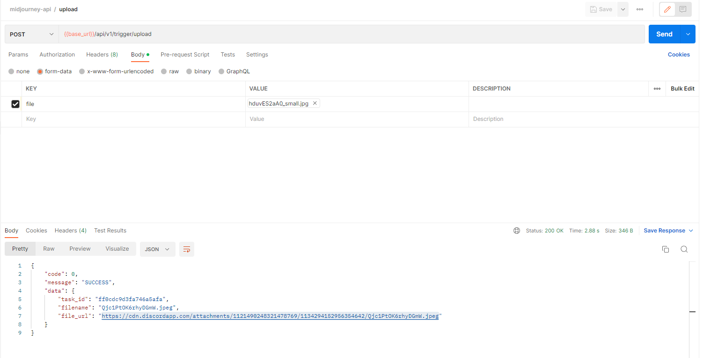
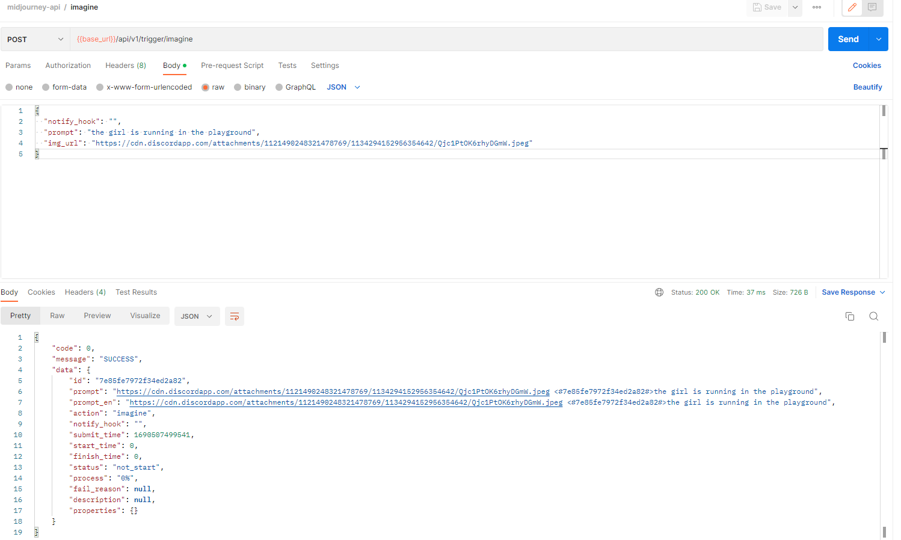
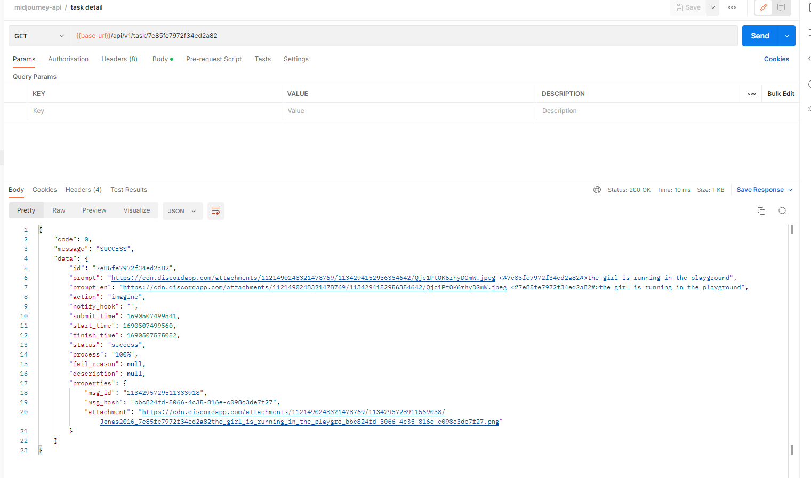

<div align="center">

<h1 align="center">Midjourney-API</h1>

Proxy the Discord channel of Midjourney and implement API based call to AI drawing（based on[Discord.py](https://github.com/Rapptz/discord.py)）


</div>


## Supports
- [x] Supports Image instructions and related U and V operations
- [x] Support for image upload
- [x] Supports the Blend instruction and related U and V operations
- [x] Supports the Describe instruction to generate prompts based on images
- [x] Support for Image, V, and Blend image generation progress
- [x] Support for Chinese prompt translation, Baidu Translation needs to be configured
- [x] Prompt sensitive word judgment, supporting coverage adjustment
- [x] Task queue, default queue 10, concurrency 3


## Preconditions
1. Register for MidJourney, create your own channel, refer to https://docs.midjourney.com/docs/quick-start
2. Obtain User Token, Server ID, and Channel ID


## Risks
1. Frequent drawing and other behaviors may trigger midjournal account warnings. Please use with caution

## Start up
```shell
# set variables
cp .env_example .env

# instal dependencies(more details, see pyproject.toml)
poetry install

# db migrations
dbmate up

# start the api service
python manage.py

# start the bot service
python bot.py
```


### API
1. Documents: ${server_url}/docs

2. Demos:



